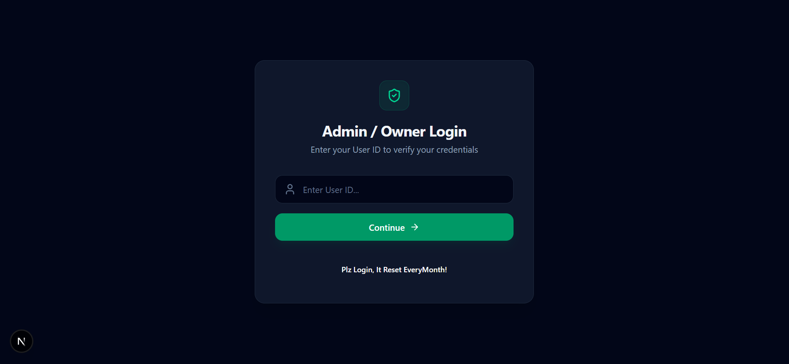
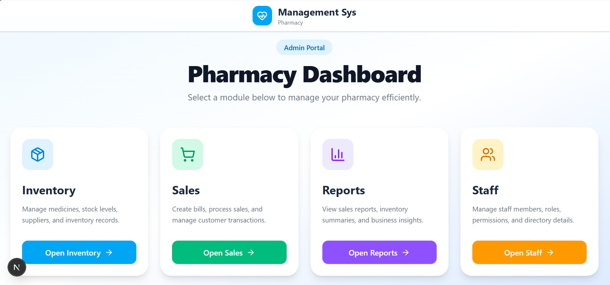
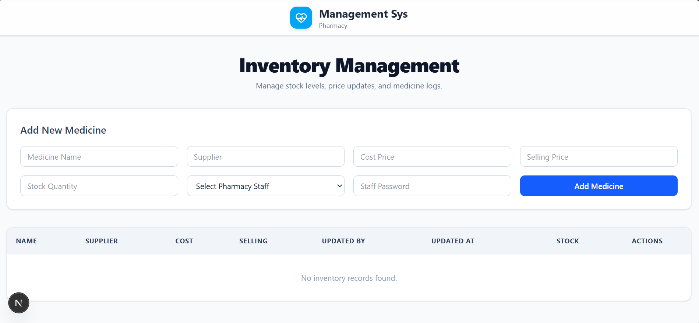
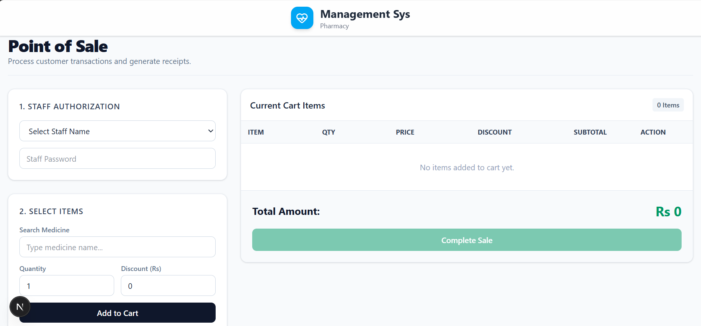
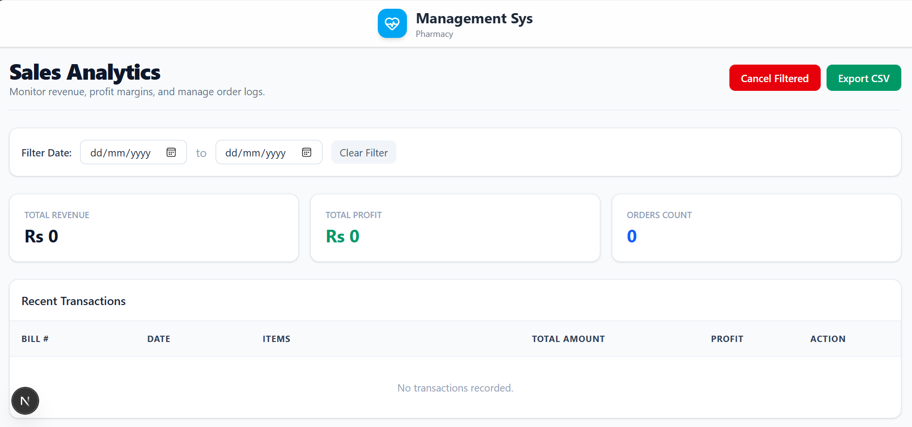
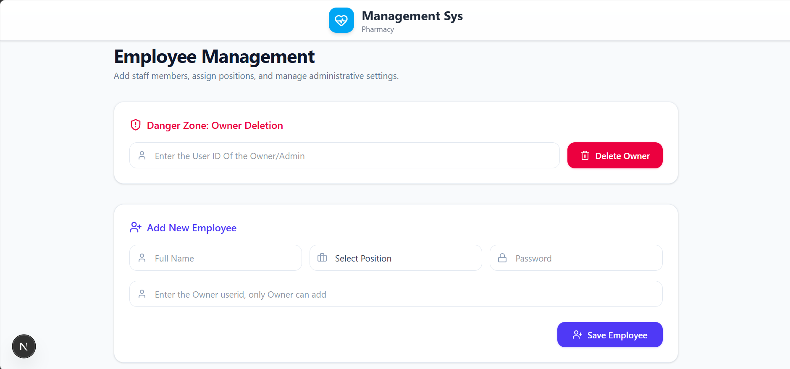

# 🏥 Pharmacy Management System

A modern full-stack **Pharmacy Management System** built to streamline pharmacy operations including inventory management, point-of-sale transactions, staff authorization, sales tracking, and financial reporting.

Built with **Next.js**, **Prisma ORM**, **SQLite**, and **Tailwind CSS**.

---

## ✨ Features

### 🔐 Secure Authentication

The system uses a hybrid authentication approach for the pharmacy owner.

* Validates the Owner/User ID through an external cloud API
* Checks whether the account exists and is active
* Denies access to inactive or unauthorized users
* Stores verified user information locally using SQLite
* Protects pharmacy routes from unauthorized access

```text
User Login
    │
    ▼
External API Validation
    │
    ├── ❌ Invalid / Inactive → Access Denied
    │
    └── ✅ Valid / Active
            │
            ▼
      Store Locally
            │
            ▼
     Access Pharmacy
```

---

## 📊 Dashboard

The central dashboard provides access to the main pharmacy operations.

| Module              | Description                                     |
| ------------------- | ----------------------------------------------- |
| 📦 Inventory        | Manage medicines, stock, suppliers, and pricing |
| 🛒 POS              | Process customer purchases and discounts        |
| 📈 Sales Reports    | Track revenue, profit, and transactions         |
| 👥 Staff Management | Manage employees and permissions                |

---

## 👥 Staff & Role-Based Access Control

The application supports role-based authorization to protect sensitive operations.

### Available Roles

* **Admin**
* **Inventory Staff**
* **Sales Staff**

### Permissions

* Owners can manage staff accounts
* Inventory staff can manage medicine stock
* Sales staff can process customer transactions
* Admins and Owners can access financial reports

Certain operations require staff authentication before they can be completed.

---

## 🛒 Point of Sale (POS)

The POS system allows pharmacy staff to quickly process customer transactions.

### Features

* 🔍 Search medicines
* 🛒 Add medicines to cart
* ➕ Adjust quantities
* 💰 Apply custom discounts
* 🧮 Automatically calculate totals
* 👤 Verify staff authorization
* ✅ Finalize transactions
* 📦 Automatically update stock

---

## 📦 Inventory Management

Manage pharmacy medicines and stock from one centralized system.

### Features

* Add new medicines
* Manage suppliers
* Track available stock
* Set cost prices
* Set selling prices
* Monitor low inventory
* Track staff activity
* Record update timestamps

Each medicine record includes information about who updated it and when.

---

## 📈 Sales Analytics & Reporting

Financial information is restricted to authorized users.

### Available for

* Owner
* Admin

### Features

* 💰 Total Revenue
* 📈 Total Profit
* 🧾 Total Orders
* 📅 Date Range Filtering
* 📊 Transaction History
* 📥 Export Sales Data to CSV
* 🗑️ Manage Transaction Records

---

# 🏗️ System Architecture

```text
                    ┌─────────────────────┐
                    │   Admin / Owner     │
                    │       Login         │
                    └──────────┬──────────┘
                               │
                               ▼
                    ┌─────────────────────┐
                    │  External Cloud API │
                    │    Validation       │
                    └──────────┬──────────┘
                               │
                    ┌──────────┴──────────┐
                    │                     │
                    ▼                     ▼
              ❌ Invalid              ✅ Valid
                    │                     │
                    ▼                     ▼
              Access Denied       Store Locally
                                          │
                                          ▼
                                  ┌───────────────┐
                                  │ SQLite +      │
                                  │ Prisma ORM    │
                                  └───────┬───────┘
                                          │
                                          ▼
                                  ┌───────────────┐
                                  │ /pharmacy    │
                                  │ Dashboard    │
                                  └───────┬───────┘
                                          │
                                          ▼
                                  Role Authorization
                                          │
                    ┌─────────────────────┼─────────────────────┐
                    ▼                     ▼                     ▼
               Inventory                POS                 Reports
```

---

# 🔄 Application Workflow

```text
1. Owner logs into the system
            ↓
2. User credentials are validated through the external API
            ↓
3. System checks whether the account is active
            ↓
4. Verified user data is stored locally
            ↓
5. User is redirected to the Pharmacy Dashboard
            ↓
6. Role-based permissions control available features
            ↓
7. Staff perform Inventory or Sales operations
            ↓
8. Transactions and stock updates are stored in SQLite
            ↓
9. Admin/Owner can view analytics and reports
```

---

# 🛠️ Tech Stack

| Technology       | Purpose                            |
| ---------------- | ---------------------------------- |
| **Next.js**      | Full-stack React framework         |
| **Prisma ORM**   | Database ORM                       |
| **SQLite**       | Local database                     |
| **Tailwind CSS** | Styling                            |
| **Lucide React** | Icons                              |
| **REST API**     | External authentication validation |

---

# 📁 Project Structure

```text
pharmacy-management-system
│
├── app
│   ├── api
│   │   ├── auth
│   │   ├── medicine
│   │   ├── sales
│   │   └── staff
│   │
│   ├── pharmacy
│   │   ├── inventory
│   │   ├── sales
│   │   ├── reports
│   │   └── staff
│   │
│   └── page.js
│
├── components
│
├── lib
│   └── prisma.js
│
├── prisma
│   └── schema.prisma
│
├── public
│
└── .env
```

> Adjust this structure to match your actual project folders.

---

# 🚀 Getting Started

## 1. Clone the Repository

```bash
git clone https://github.com/abubakarchohan2006/pharmacy-sys.git
```

```bash
cd pharmacy-management-system
```

---

## 2. Install Dependencies

Using npm:

```bash
npm install
```

Or using Yarn:

```bash
yarn install
```

---

## 3. Configure Environment Variables

Create a `.env` file in the root directory.

```env
DATABASE_URL="file:./dev.db"

EXTERNAL_AUTH_API="https://your-external-api.com/users"
```

---

## 4. Setup the Database

Run the Prisma migration:

```bash
npx prisma migrate dev --name init
```

Generate the Prisma Client:

```bash
npx prisma generate
```

---

## 5. Start the Development Server

Using npm:

```bash
npm run dev
```

Or Yarn:

```bash
yarn dev
```

Open the application in your browser:

```text
http://localhost:3000
```

---

# 📸 Application Screenshots

## 🔐 Login



## 📊 Dashboard



## 📦 Inventory Management



## 🛒 Point of Sale



## 📈 Sales Reports



## 👥 Staff Management



---
# 🔒 Security

The application includes several authorization layers:

* External account validation
* Active account verification
* Protected pharmacy routes
* Role-based authorization
* Staff password verification for sensitive actions

---

# 📌 Future Improvements

* [ ] Barcode scanning
* [ ] Low-stock notifications
* [ ] Customer management
* [ ] Supplier management
* [ ] Cloud database synchronization
* [ ] Multi-pharmacy support
* [ ] Advanced analytics dashboard
* [ ] Automated backups

---

## 👨‍💻 Author

Built as a full-stack pharmacy management project using modern web technologies.

⭐ If you found this project useful, consider giving the repository a star!